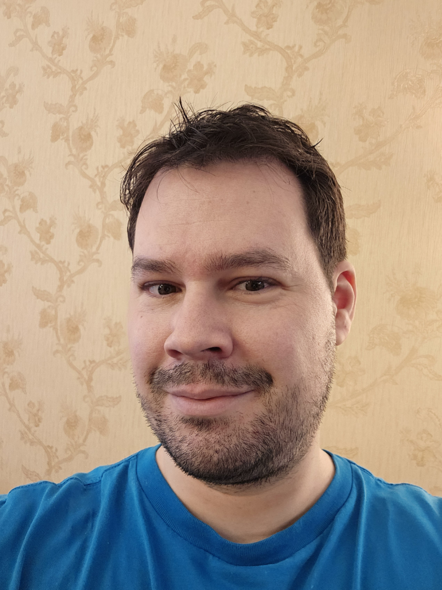

# About

Milos Vasic is highly-skilled software engineer bringing years in software design, development, and
integration. Advanced knowledge of Android, React Native and Flutter. 
Main programming languages: Java, Kotlin, Dart, TypeScript and C++. 
Experienced in the full project life cycle from design to implementation to integration.

- Date of birth: 25.07.1985. (Belgrade, Serbia)
- E-Mail: [i@mvasic.ru](mailto:i@mvasic.ru)
- Mobile: [+381 69 25 35 718 (Serbia)](tel:+381692535718), [+7 966 323 77 17 (Russian Federation)](tel:+79663237717)
- Language: Serbian, English, Russian.
- Source code and Open-Source: [GitHub](https://github.com/milos85vasic), [GitFlic](https://gitflic.ru/user/milosvasic)
- Telegram: [milos85vasic](https://t.me/milos85vasic)
- Networks: [Linkedin](https://www.linkedin.com/in/милош-васић-53778682/), [TenChat](https://tenchat.ru/milosvasic), [Xing](https://www.xing.com/profile/Milos_Vasic4/cv), [VK](https://vk.com/milos.vasic)
- Some of the Open-Source work: [Mail Server Factory](https://github.com/Server-Factory/Mail-Server-Factory), [Android Toolkit](https://github.com/red-elf/Android-Toolkit), [HelixTrack](https://github.com/Helix-Track/Core)

## Education

- Bachelor of Science: Informatics and Computing, 2008. University Singidunum, Belgrade (Serbia)
- M.Sc: Contemporary Information Technologies, 2014. University Singidunum, Belgrade (Serbia)

## Technology

Using the following technology:

- Android, JetPack Compose, MVVP, Retrofit, OkHttp, Firebase, etc.
- React Native, Expo, Npm, Yarn
- Flutter
- Kotlin, Kotlin Coroutines, Java, Swift, Dart, JavaScript, TypeScript, C++
- Also: Python, Ruby, Bash, Go, iOS, QT
- Additional: Docker, Docker Compose, 
- Sqlite, Postgres, MongoDB, Redis
- Linux, macOS

## Experience

Through the career have been working on the various projects and with various clients.

- [Harness](http://harness.io/) - Belgrade, Serbia (full-time), from 03/2020 until 12/2024, Staff software engineer
- [Leica Geosystems](https://leica-geosystems.com/) - Heerbrugg, Switzerland (full-time), from 02/2016 until 02/2020, Android and iOS developer
- [Bosch](https://www.bosch.rs/) - Belgrade, Serbia (full-time), from 01/2010 until 01/2016, Android SDK developer